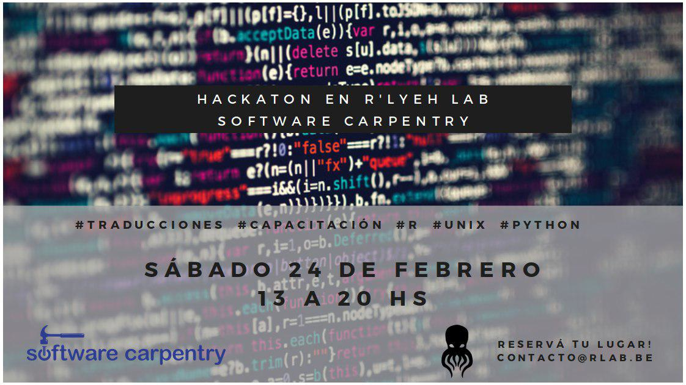

# R Hackatón 
 
##  Hackatón para apoyar con la traducción de la "R Gapminder" lección de Software Carpentry al español

- **Lugar:** R'lyeh Hacklab [¿Cómo ir al lab?](https://wiki.rlab.be/doku.php?id=como-llegar)
- **Cuando:** 24 Febrero 2018 de 13:00 a 20:00

## Metas y objectives
- Obtenga información sobre la comunidad de Software Carpentry (SWC) y sus recursos para aprender a programar
- Continúa traduciendo la lección SWC 'R Gapminder' de inglés a español. Detalles a https://github.com/Carpentries-ES/r-novice-gapminder/issues/48
- Practica como usar git y github para publicar la leccion traducida
- Practica enseñando las lecciones y obtén valiosos comentarios de tus compañeros
- Planificar un taller oficial de SWC (quizás al fin de Marzo)

## Agenda

| Hora | Actividad |
| ----- | --------- |
| 15:00 | Bienvenida e introducciones |
| 15:30 | Descripción de las prácticas de enseñanza de SWC y la lección 'R Gapminder' |
| 16:00 | [Apoyar con la traducción de la lección **SWC 'R Gapminder**'](https://github.com/Carpentries-ES/r-novice-gapminder/issues/48)   [Apoyar con la traducción de la **workshop-template-es**](https://github.com/Carpentries-ES/workshop-template-es/issues)|
| 17:00 | Descanso |
| 17:30 | [Práctica enseñando las lecciones](http://carpentries.github.io/instructor-training/11-practice-teaching/) |
| 18:30 | Descanso |
| 19:00 | Planifique un taller oficial de SWC |
| 19:45 | Conclusión y foto de grupo |

## Software Carpentry Etherpad
Podemos usar este documento colaborativo para tomar notas durante el hackaton: 
http://pad.software-carpentry.org/2018-02-24-hackaton

## Resources
- **R'lyeh Hacklab**: https://t.co/YrSxvgAKWc
- **Software Carpentry (SWC) website**: https://software-carpentry.org/
- **Convenciones_Traduccion**: https://github.com/Carpentries-ES/board/blob/master/Convenciones_Traduccion.md
- **R Gapminder lección en español**: https://github.com/Carpentries-ES/r-novice-gapminder
- **UNIX lección en español**: https://swcarpentry.github.io/shell-novice-es/
- **Git lección en español**: https://swcarpentry.github.io/git-novice-es/
- **Carpentry Instructor Training**: http://carpentries.github.io/instructor-training/

## Participantes
- Nombre | GitHub | Twitter
- Rayna Harris | [@raynamharis](https://github.com/raynamharris) | [@raynamharis](https://twitter.com/raynamharris)
- Juli Arancio | [@thessaly](https://github.com/thessaly) | [@Cassandreces](https://twitter.com/Cassandreces)
- Panda | [@marshmaline](https://github.com/marshmaline)
- Guillermo Movia | [@deimidis](https://github.com/deimidis) | [@deimidis](https://twitter.com/deimidis)
-
-
-
-
-
-
